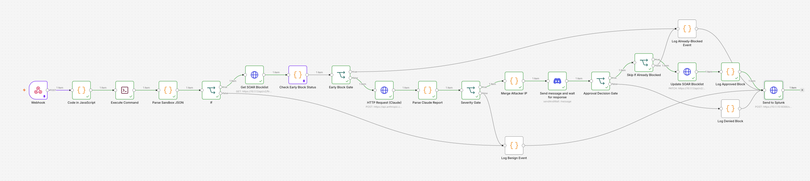

# Project 4: Autonomous SOAR Engine with AI Triage & Human-in-the-Loop Response

A closed-loop security orchestration, automation, and response (SOAR) pipeline integrating Splunk SIEM, n8n workflow automation, Docker sandboxing, Claude AI triage, Discord human-in-the-loop gates, and pfSense automated firewall response.

📄 **Complete Technical Report:** [Project 4 Writeup (PDF)](report/project-4-writeup.pdf)

## 🏗️ Architecture

```
Splunk Webhook → n8n Ingestion → Docker Python Sandbox
                                          |
                                   [is_malicious?]
                                    /           \
                            (False) Stop    (True) Already Blocked?
                                                     /           \
                                              (Yes) Skip    (No) Claude AI Triage
                                                                       |
                                                              Severity Gate
                                                               /         \
                                                      (LOW/MED)      (CRITICAL/HIGH)
                                                     Log & Stop    Discord HITL Approval
                                                                     /            \
                                                            (Approve)         (Deny)
                                                       pfSense Auto-Block   Log & Stop
                                                              |
                                                       Splunk Audit Writeback
```



## 🛠️ Quick Start

1. **Clone the repository:**
   ```bash
   git clone https://github.com/antonvikstrom/project4-soar-pipeline.git
   cd project4-soar-pipeline
   ```

2. **Start the n8n workflow engine:**
   ```bash
   docker compose up -d
   ```

3. **Import the workflow:** Open n8n in your browser, import
   `workflows/Project4-SOAR-Pipeline.json` and activate it.

4. **Deploy the sandbox analyzer:** Place `sandbox_analyzer.py` in the mounted `/app` directory.

5. **Configure upstream triggers:** Point your Splunk webhook alert action at n8n's production webhook URL.

> **⚠️ Before running:** The workflow JSON contains placeholders
> (`insert-your-api-key-here`, `insert-your-webhook-id-here`,
> `your-hec-token-here`, `10.x.x.x`). Replace these with your
> own pfSense REST API key, Splunk HEC token, Discord credentials,
> and actual host IP addresses before activating the workflow.

## 📂 Repository Layout

- `docker-compose.yml` — n8n container with Docker socket, app bind mount, and required environment variables
- `sandbox_analyzer.py` — Python risk-scoring engine that evaluates raw alert payloads before LLM triage
- `workflows/` — Exported n8n workflow JSON for importing into a fresh n8n instance
- `bin/` — Helper scripts (e.g. `run_sandbox.sh`)
- `.env` — Environment variables for n8n (WEBHOOK_URL, NODE_FUNCTION_ALLOW_BUILTIN, etc.)
- `report/` — Complete PDF project writeup

## 🔑 Key Design Principles

**Pre-LLM suppression.** A local Python sandbox scores every alert before it reaches Claude. Benign events and already-blocked IPs are filtered out early, saving API costs and reducing noise.

**Human-in-the-loop before destructive action.** No firewall block happens automatically. Every high-severity alert posts to a dedicated Discord channel with Approve/Decline buttons, and the n8n workflow pauses until a human responds.

**Closed-loop audit trail.** All five pipeline outcomes (benign, already-blocked, denied, approved block, low-severity pass) are written back to Splunk via HTTP Event Collector, indexed in a dedicated `soar_audit` index for querying alongside the original detection events.

**Least-privilege container hardening.** n8n runs as non-root UID 1000 with Docker socket access via group mapping. API keys are stored in n8n's encrypted credential store, not in workflow nodes or plaintext .env files.

**Honest about limitations.** The pfSense alias update uses a read-modify-write pattern with a known race condition under concurrent alerts. Documented as a limitation rather than glossed over.

## 🎯 MITRE ATT&CK Coverage

| Technique                              | ID    | Detection Trigger                                     |
| -------------------------------------- | ----- | ----------------------------------------------------- |
| File and Directory Discovery           | T1083 | Path traversal via `page=../../../../etc/passwd`      |


## 🔧 Technologies

Splunk (SPL, HTTP Event Collector) · n8n · Docker · Python · Anthropic Claude API · Discord Bot API · pfSense REST API (pfrest/pfSense-pkg-RESTAPI) · MITRE ATT&CK · Proxmox VE
